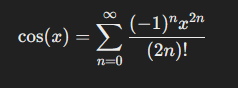
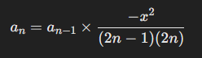
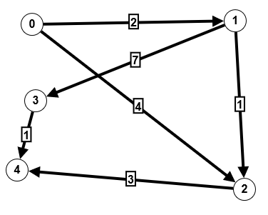
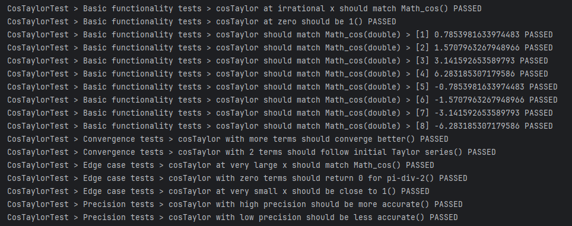
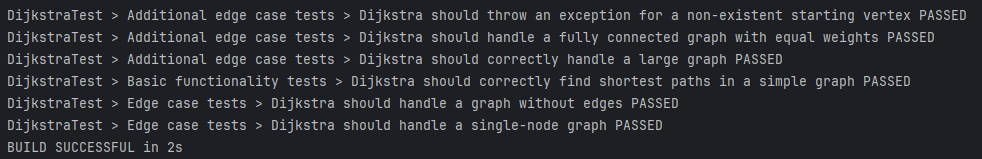

# Лабораторная работа №3

Хасаншин Марат Айратович P3333  
Дмитриев Андрей Иванович P3334

## Исходный текст задания

1. Для указанной функции провести модульное тестирование разложения функции в степенной ряд. Выбрать достаточное тестовое покрытие.
2. Провести модульное тестирование указанного алгоритма. Для этого выбрать характерные точки внутри алгоритма, и для предложенных самостоятельно наборов исходных данных записать последовательность попадания в характерные точки. Сравнить последовательность попадания с эталонной.
3. Сформировать доменную модель для заданного текста.  Разработать тестовое покрытие для данной доменной модели

## Вариант - **368988**

1. Функция cos(x)
2. Программный модуль для поиска кратчайшего пути в ориентированном графе по алгоритму Дейкстры (http://www.cs.usfca.edu/~galles/visualization/Dijkstra.html)
3. Описание предметной области:

    ```Земля провалилась там, где упал кит, обнаружив целую сеть галерей и переходов, которые теперь были сильно завалены обломками и потрохами. Зафод начал расчищать один из проходов, но у Марвина это вышло гораздо быстрее. Сырой воздух поднимался из темных глубин, и когда Зафод посветил фонарем внутрь, мало что было видно в пыльном мраке.```

### Реализация разложения косинуса в степенной ряд

Реализовано в [CosTaylor.kt](src/main/kotlin/CosTaylor.kt)
Формула разложения косинуса - 

Применена оптимизация, считаем следующий элемент по предыдущему - 


```kotlin
fun cosTaylor(x: Double, tolerance: Double = 1e-6, maxTerms: Int = 100): Double {

    val xNorm = x % (2 * PI)
    var result = 0.0
    var term = 1.0
    var n = 0

    result += term
    n++

    while (n < maxTerms) {
        term *= -xNorm * xNorm / ((2 * n - 1) * (2 * n))
        result += term

        if (abs(term) < tolerance) break

        n++
    }

    return result
}
```

### Тестирование cos

Тесты реализованы в [CosTaylorTest.kt](src/test/kotlin/CosTaylorTest.kt)

1. Тестирование базовых случаев

```kotlin
@Nested
@DisplayName("Basic functionality tests")
inner class BasicCases {

   @Test
   fun `cosTaylor at zero should be 1`() {
      assertEquals(1.0, cosTaylor(0.0, precision), precision)
   }

   @ParameterizedTest
   @ValueSource(doubles = [PI / 4, PI / 2, PI, 2 * PI, -PI / 4, -PI / 2, -PI, -2 * PI])
   fun `cosTaylor should match Math_cos`(x: Double) {
      assertEquals(cos(x), cosTaylor(x, precision), precision)
   }

   @Test
   fun `cosTaylor at irrational x should match Math_cos`() {
      val x = PI / Math.E
      assertEquals(cos(x), cosTaylor(x, precision), precision)
   }
}
```

2. Тестирование краевых случаев (очень маленькое/большое число)

```kotlin
@Nested
@DisplayName("Edge case tests")
inner class EdgeCases {

   @Test
   fun `cosTaylor at very large x should match Math_cos`() {
      val x = 1e10
      assertEquals(cos(x), cosTaylor(x, precision), precision)
   }

   @Test
   fun `cosTaylor at very small x should be close to 1`() {
      val x = 1e-10
      assertEquals(cos(x), cosTaylor(x, 1e-12), 1e-12)
   }

   @Test
   fun `cosTaylor with zero terms should return 0 for pi-div-2`() {
      val x = PI / 2
      assertEquals(0.0, cosTaylor(x, precision), precision)
   }
}
```

3. Тестирование функции с маленькой/высокой точностью

```kotlin
@Nested
@DisplayName("Precision tests")
inner class PrecisionTests {

  @Test
  fun `cosTaylor with high precision should be more accurate`() {
      val x = PI / 4
      val resultHigh = cosTaylor(x, 1e-12)
      assertEquals(cos(x), resultHigh, 1e-12)
  }

  @Test
  fun `cosTaylor with low precision should be less accurate`() {
      val x = PI / 4
      val resultLow = cosTaylor(x, 1e-2)
      assertEquals(cos(x), resultLow, 1e-2)
  }
}
```

4. Тестирование конвергенции (при большем количестве элементов ряда должна повышаться точность)

```kotlin
@Nested
@DisplayName("Convergence tests")
inner class ConvergenceTests {

  @Test
  fun `cosTaylor with more terms should converge better`() {

      val x = PI / 3
      val exactValue = cos(x)

      val resultLowTerms = cosTaylor(x, precision, 5)
      val resultHighTerms = cosTaylor(x, precision, 15)

      val errorLow = kotlin.math.abs(resultLowTerms - exactValue)
      val errorHigh = kotlin.math.abs(resultHighTerms - exactValue)

      assert(errorHigh < errorLow)
  }

  @Test
  fun `cosTaylor with 2 terms should follow initial Taylor series`() {
      val x = PI / 4
      val expected = 1.0 - (x * x) / 2
      assertEquals(expected, cosTaylor(x, precision, 2), precision)
  }
}
```

### Реализация Алгоритма Дейкстры для ориентированного графа

Реализовано в [Dkstr.kt](src/main/kotlin/Dkstr.kt)

```kotlin
fun dijkstra(start: Int): DoubleArray {
        val distances = DoubleArray(vertices) { Double.POSITIVE_INFINITY }
        distances[start] = 0.0

        val priorityQueue = PriorityQueue(compareBy<Pair<Int, Double>> { it.second })
        priorityQueue.add(Pair(start, 0.0))

        val visited = BooleanArray(vertices)

        while (priorityQueue.isNotEmpty()) {
            val (currentVertex, currentDistance) = priorityQueue.poll()

            if (visited[currentVertex]) continue
            visited[currentVertex] = true

            logCallback?.invoke(currentVertex, currentDistance)

            for (edge in adjacencyList[currentVertex]) {
                val distance = currentDistance + edge.weight

                if (distance < distances[edge.target]) {
                    distances[edge.target] = distance
                    priorityQueue.add(Pair(edge.target, distance))
                }
            }
        }

        return distances
    }
```

### Тестирование Дейкстры

Тесты реализованы в [DkstrTest.kt](src/test/kotlin/DkstrTest.kt)

1. Тестирование базовых случаев



```kotlin
@Nested
@DisplayName("Basic functionality tests")
inner class BasicTests {

  @Test
  @DisplayName("Dijkstra should correctly find shortest paths in a simple graph")
  fun `dijkstra finds shortest paths`() {
      val graph = createGraphWithEdges()

      val log = mutableListOf<Pair<Int, Double>>()
      graph.logCallback = { vertex, distance -> log.add(Pair(vertex, distance)) }

      graph.dijkstra(0)

      val expectedLog = listOf(
          Pair(0, 0.0),
          Pair(1, 2.0),
          Pair(2, 3.0),
          Pair(4, 6.0),
          Pair(3, 9.0)
      )

      assertEquals(expectedLog, log)
  }
}
```

2. Тестирование краевых случаев (граф из 1 вершины, без ребер, одинаковое расстояние, тысяча вершин)


```kotlin
@Nested
@DisplayName("Edge case tests")
inner class EdgeCases {

  @Test
  @DisplayName("Dijkstra should handle a single-node graph")
  fun `dijkstra with single node`() {
      val graph = Graph(1)

      val log = mutableListOf<Pair<Int, Double>>()
      graph.logCallback = { vertex, distance -> log.add(Pair(vertex, distance)) }

      graph.dijkstra(0)

      val expectedLog = listOf(Pair(0, 0.0))
      assertEquals(expectedLog, log)
  }

  @Test
  @DisplayName("Dijkstra should handle a graph without edges")
  fun `dijkstra with empty graph`() {
      val graph = Graph(5)
      val distances = graph.dijkstra(0)

      assertEquals(0.0, distances[0])
      for (i in 1 until 5) {
          assertEquals(Double.POSITIVE_INFINITY, distances[i])
      }
  }
}

@Nested
@DisplayName("Additional edge case tests")
inner class AdditionalEdgeCases {

  @Test
  @DisplayName("Dijkstra should handle a fully connected graph with equal weights")
  fun `dijkstra with equal weights`() {
      val graph = Graph(4)
      for (i in 0 until 4) {
          for (j in 0 until 4) {
              if (i != j) graph.addEdge(i, j, 1.0)
          }
      }

      val distances = graph.dijkstra(0)
      val expectedDistances = listOf(0.0, 1.0, 1.0, 1.0)
      assertEquals(expectedDistances, distances.toList())
  }

  @Test
  @DisplayName("Dijkstra should throw an exception for a non-existent starting vertex")
  fun `dijkstra with invalid start vertex throws exception`() {
      val graph = createGraphWithEdges()
      assertThrows(IndexOutOfBoundsException::class.java) {
          graph.dijkstra(10)
      }
  }

  @Test
  @DisplayName("Dijkstra should correctly handle a large graph")
  fun `dijkstra with large graph`() {
      val graph = Graph(1000)
      for (i in 0 until 999) {
          graph.addEdge(i, i + 1, 1.0)
      }
      val distances = graph.dijkstra(0)
      assertEquals(999.0, distances[999])
  }
}
```


### Результаты тестирование

#### Косинус



#### Дейкстра

